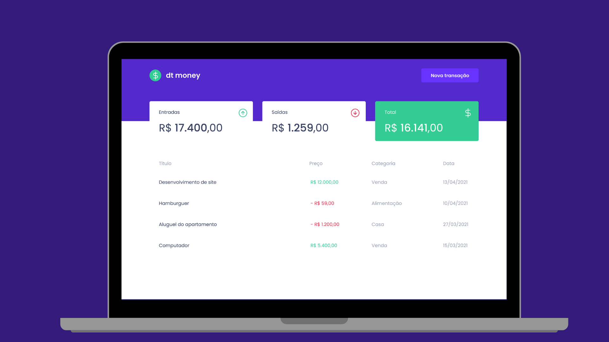

<p align="center">
    
</p>

<div align="center">
	<p>:moneybag:Manage your money.</p>
	<p>Projeto desenvolvido durante o Bootcamp Ignite chapter II da trilha de React.</p>
	<p>
		Made with ♥ by <a href="https://github.com/LaisLuderer">Laís Luderer</a>
	</p>
</div>

## :rocket: Technologies

Esse projeto foi feito com as seguintes tecnologias:
- [Typescript](https://www.typescriptlang.org/)  
-  [ReactJS](https://reactjs.org/)
-  [Axios](https://github.com/axios/axios)
-  [styled-components](https://www.styled-components.com/)
- [MirageJS](https://miragejs.com/)

## :information_source: How To Use

```bash
# Clone this repository
$ git clone https://github.com/LaisLuderer/00.git

# Install dependencies
$ yarn install

# Run Aplication
$ yarn start
```

## :memo: License
This project is under the [MIT LICENSE](https://github.com/lukemorales/rocketshoes-react-native/blob/master/LICENSE).<br>
Made with ♥ by Lais Luderer

---
